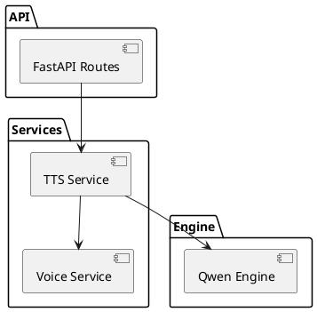

# 05. Building Block View

This section provides an overview of the system's architecture at different levels of abstraction.

## Level 1: White Box
The system is divided into four main packages:
* **API Layer (src/api):** Handles HTTP and WebSocket requests, validates parameters, and routes to business logic.
* **Services (src/services):** Orchestrates the business processes (TTS, voice integrity, splitting, caching).
* **Engine (src/engine):** Adaptor for TTS generation engines.
* **Core (src/core):** Interfaces (ports) and domain-specific exceptions.

## Diagram (PlantUML)

