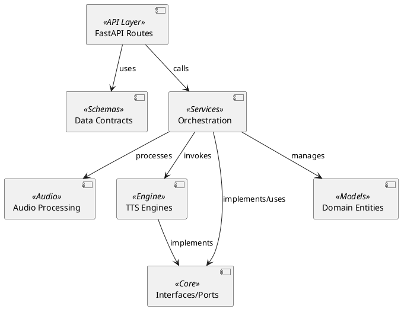

# 05. Building Block View

This section provides an overview of the system's architecture at different levels of abstraction, following Hexagonal Architecture principles to ensure modularity and separation of concerns.

## Level 1: White Box

The system is organized into the following key packages:

*   **API Layer (`src/api`):** Handles incoming HTTP/WebSocket requests, parameter validation, and routing.
*   **Schemas (`src/schemas`):** Defines data contracts (request/response models) used for input validation and API communication.
*   **Services (`src/services`):** The orchestration layer containing business logic for voice management, SSML processing, and TTS coordination.
*   **Audio (`src/audio`):** Dedicated to audio post-processing and manipulation.
*   **Engine (`src/engine`):** Infrastructure adapters implementing the actual TTS synthesis logic (e.g., Qwen).
*   **Core (`src/core`):** Domain definitions, including interfaces (ports) and domain-specific exceptions.
*   **Models (`src/models`):** Persistent data structures and domain entities.

## Diagram (PlantUML)

